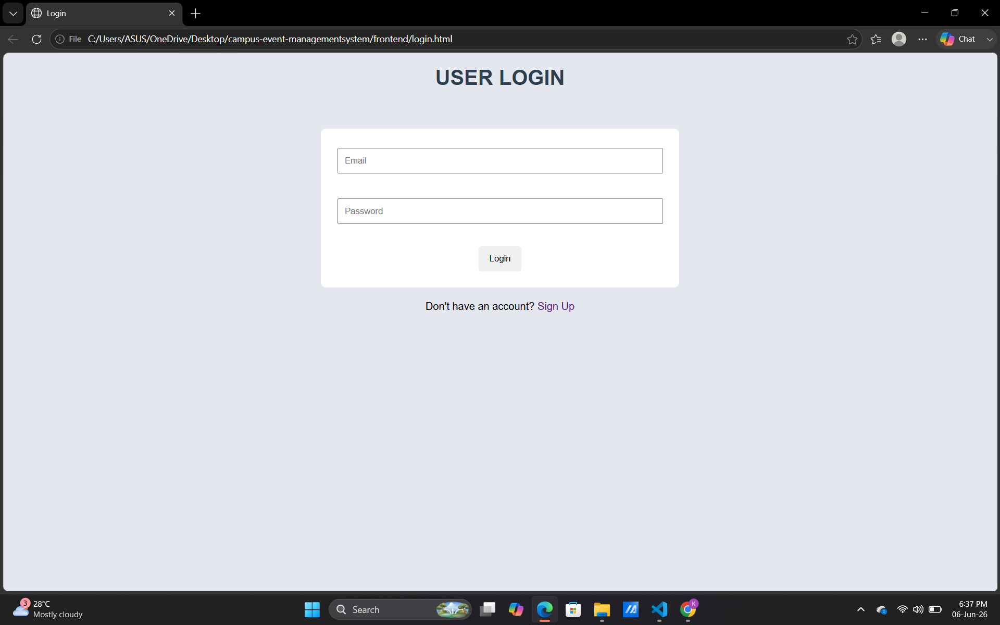
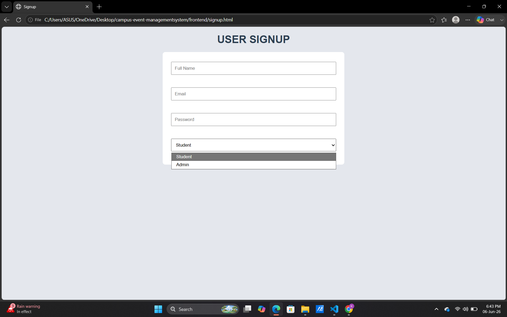
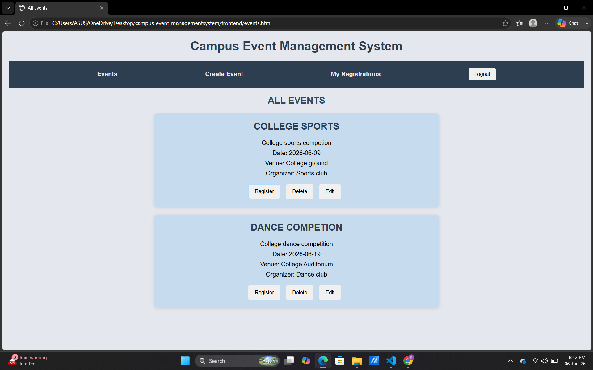
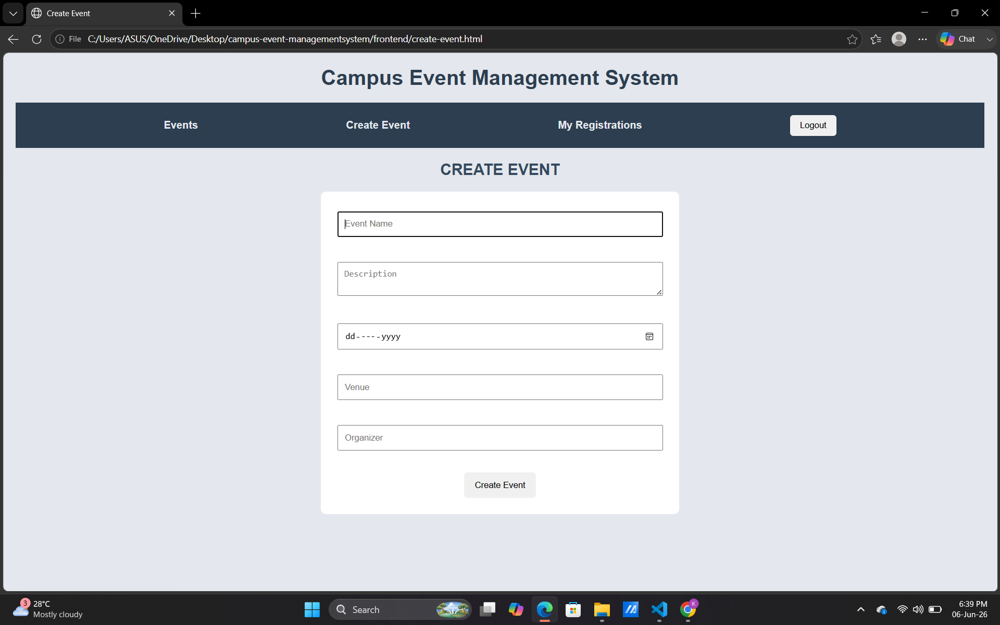
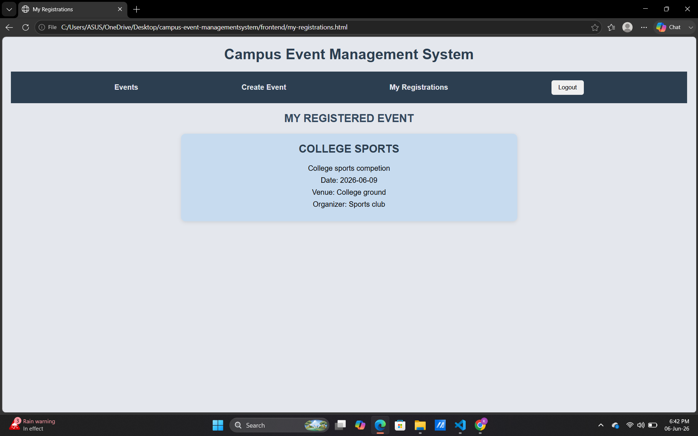

# Campus Event Management System

A full-stack web application that allows students to view and register for campus events while enabling administrators to create, edit, and manage events.

## Features

### User Authentication
- User Signup
- User Login
- Logout Functionality

### Role-Based Access Control
- Student Role
- Admin Role
- Protected Event Management Features

### Event Management
- Create Events
- View Events
- Edit Events
- Delete Events

### Event Registration
- Register for Events
- View Registered Events

## Technologies Used

### Frontend
- HTML
- CSS
- JavaScript

### Backend
- Node.js
- Express.js

### Database
- MySQL

## Project Structure

campus-event-management-system/
│
├── frontend/
│ ├── login.html
│ ├── signup.html
│ ├── events.html
│ ├── create-event.html
│ ├── my-registrations.html
│ └── css/
│ └── style.css
│
├── backend/
│ ├── server.js
│ ├── package.json
│ └── node_modules/
│
└── README.md


## How to Run the Project

## How to Run the Project

### 1. Clone the Repository

```bash
git clone https://github.com/keerthanaanil510-svg/campus--event--management--system.git
```

### 2. Navigate to the Backend Folder

```bash
cd backend
```

### 3. Install Dependencies

```bash
npm install
```

### 4. Configure MySQL Database

Create a MySQL database named:

```sql
CREATE DATABASE campus_management;
```

Create the required tables:

- users
- events
- registrations

Update the database connection details in `server.js` if needed.

### 5. Start the Backend Server

```bash
node server.js
```

Or, if using nodemon:

```bash
npx nodemon server.js
```

### 6. Open the Frontend

Open the frontend files in your browser, starting with:

```text
frontend/login.html
```

### 7. Login and Use the Application

- Students can view and register for events.
- Admins can create, edit, and delete events.


## Screenshots

### Login Page



### Signup Page



### Events Page



### Create Event Page



### My Registered Events



## Key Learning Outcomes

- Frontend and Backend Integration
- REST API Development
- MySQL Database Integration
- Authentication and Authorization
- CRUD Operations
- Git and GitHub Workflow

## Future Improvements

- Password Hashing using bcrypt
- Event Search and Filtering
- Email Notifications
- Event Posters and Images
- Cloud Deployment

## Author

Keerthana K V